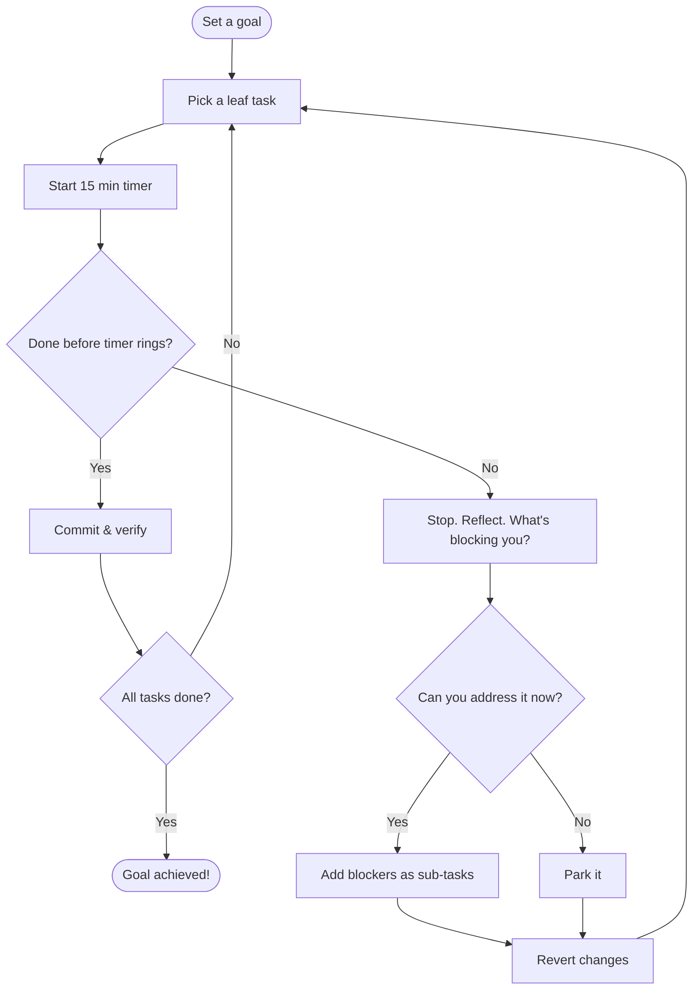

# The Mikado Method

A structured technique for making large-scale changes to complex systems. Instead of attempting a big change all at once, you decompose it into a dependency graph of smaller tasks and tackle them bottom-up.

- [The Mikado Method](https://mikadomethod.info/)
- [Use the Mikado Method to do safe changes in a complex codebase](https://understandlegacycode.com/blog/a-process-to-do-safe-changes-in-a-complex-codebase)

## Core Concepts

- **Goal**: the main change you want to achieve. One goal per Mikado graph. It's the root node.
- **Sub-task**: a prerequisite that must be completed before a parent task can succeed. Sub-tasks can have their own sub-tasks, forming a tree.
- **Dependency**: a directed edge from a task to its prerequisite. "Task A depends on Task B" means B must be done before A.
- **Leaf node**: a task with no prerequisites. These are the tasks you can start working on right now.
- **Parked task**: a task you can't address right now (blocked by something outside your control). Set aside and revisited later.

## The Workflow

1. **Set a goal.** Define what you want to achieve.
2. **Pick a leaf task.** Choose a task with no unfinished prerequisites.
3. **Start a timer (15 min).** Begin working on the task.
4. **If you finish before the timer rings:** commit, verify, mark the task done. Move to the next leaf.
5. **If the timer rings and you're not done:** stop. Reflect on what's blocking you.
   - If you can address the blockers: write them down as new sub-tasks.
   - If you can't address them now: park the task for later.
   - Either way: revert your changes (`git reset --hard`) and go back to step 2.
6. **Work your way up.** As leaf nodes complete, parent tasks become unblocked. Continue until the goal is done.

Two key insights:

- You never stay in a broken state. You always revert and work on the smallest achievable change first.
- The timer forces honest decomposition. If 15 minutes isn't enough, the task is too big.

## How This Maps to Nikado

| Mikado Concept    | Nikado Representation                                        |
| ----------------- | ------------------------------------------------------------ |
| Goal              | Root node of the graph                                       |
| Sub-task          | Child node connected via edge                                |
| Dependency        | Directed edge (parent > child = "parent depends on child")   |
| Leaf node         | Node with no outgoing edges, highlighted as a starting point |
| Working on a task | Task marked as `current`                                     |
| Completed task    | Task marked as `done`                                        |
| Not started       | Task marked as `pending` (default)                           |
| Parked task       | Task marked as `parked`                                      |

## Task States

A task is always in exactly one state:

- **`pending`**: not started yet (default for new tasks)
- **`current`**: the user is actively working on this task
- **`done`**: completed successfully
- **`parked`**: blocked by something outside your control. Set aside for later.

A task can only be marked `done` if all of its sub-tasks are also `done`. This enforces the bottom-up workflow. A parked task can be unparked (back to `pending`) at any time.

## UX Principle

The user should always see which leaf nodes they can work on next. The graph should make it visually obvious where to start and what's blocking progress.
